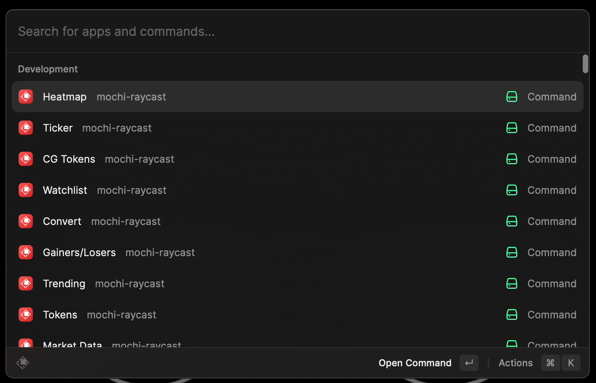
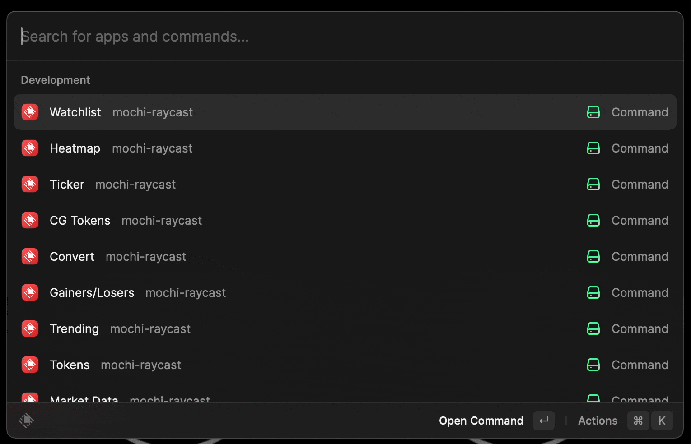
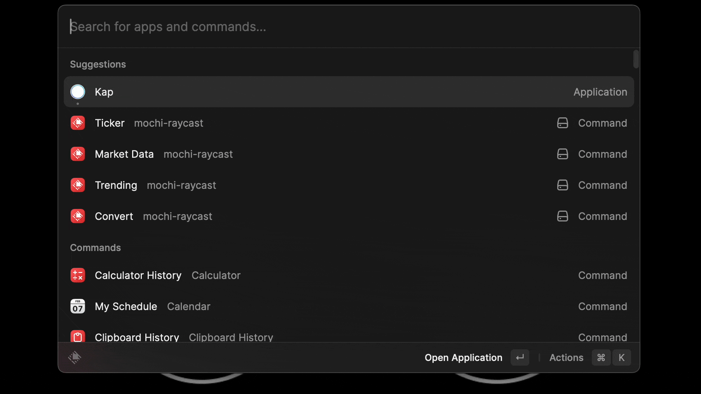
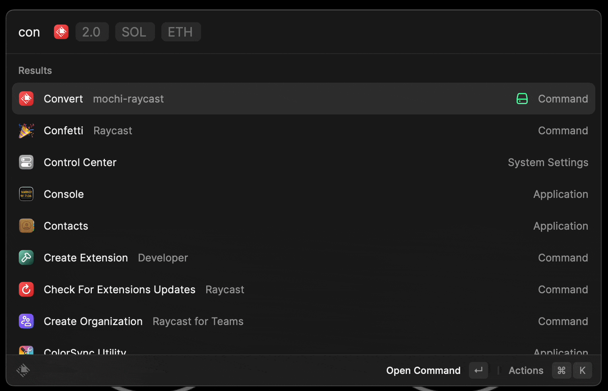
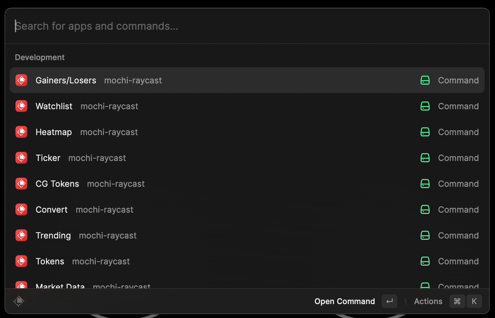
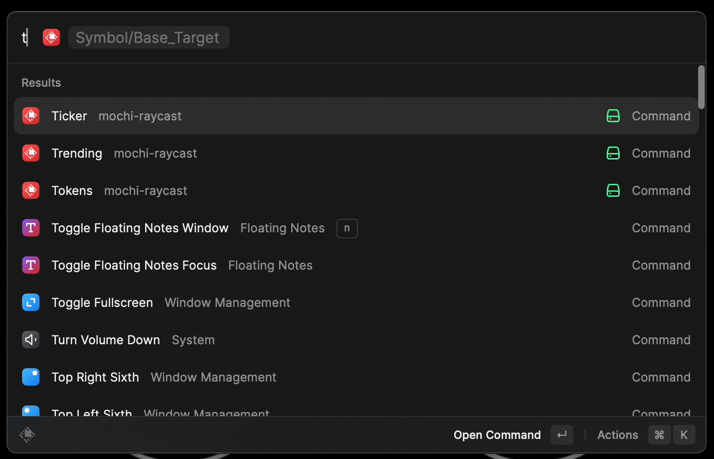
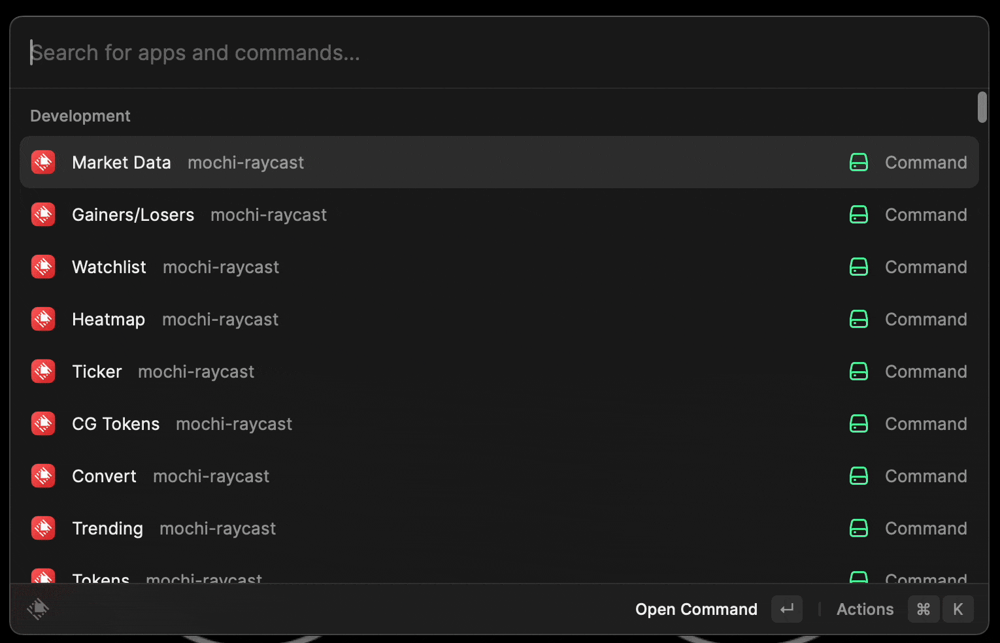

# Mochi Raycast Extension

A raycast extension that lets you

1. get overall market information
2. fetch gainers/losers tokens
3. see trending tokens
4. peeks at your wathclist
5. convert between tokens
6. see information about your favourite tokens

---

## Tech Used

1. [Serverless functions](https://github.com/munanadi/ntl-moshi-chart) are used to render charts as we cannot render chart primitives from within the Raycast extension.

2. [Mochi's APIs](https://mochibot.gitbook.io/mochi-bot/functions/mochi-apis/crypto-management) from their docs to call various end points

## Commands

### 1. heatmap

Shows the market in a heatmap

### 2. watchlist

Shows the tokens overview in your watchlist

### 3. ticker

Show details about a given ticker

base/target

### 4. convert

Convert $value between different tokens

### 5. gainers/losers

Show the top 5 gainers/ losers in 1D

### 6. Trending

Show the top trendings tokens in 1D

### 7. Coin Gecko tokens

List of all Coin Gecko tokens

### 8. Market Data

Market data from Moshi API

